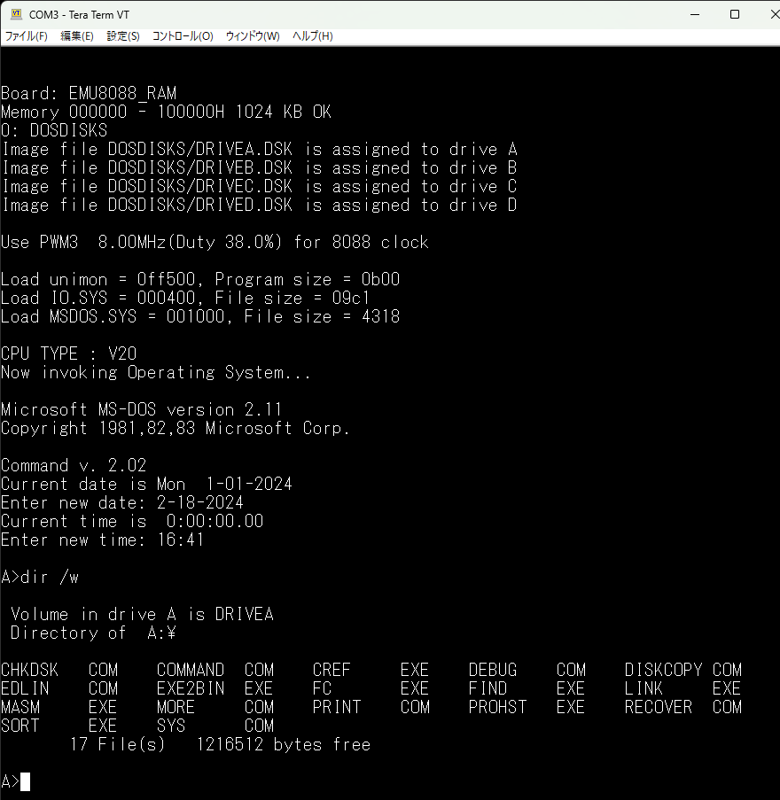

# EMU8088_57Q 
 
PIC18F47Q43はDIP40ピンで、電脳伝説さんがそれを使用したSBCであるEMUZ80を 
公開されたのがきっかけで、その後コアな愛好者によって、色々な拡張や 
新しいSBCが公開されています。 
 
PIC18F57Q43は、QFP48ピンのパッケージに収められており、仕様は47Qと変わりませんが、 
I/Oが8ピン多いのが特徴です。 
 
このPIC18F57Q43を使った8088/用のSBCを作成し、CPM-86を移植、公開しています 
SBCについての詳細と、Gerberデータは、以下を参照してください。 
 
＜EMU8088_57Q_CPM86＞ 
https://github.com/akih-san/EMU8088_57Q_CPM86
 
EMU8088_57Q SBCボード

# MS-DOS V2.11の移植 
このSBCにMS-DOS V2.11を移植しました。8088/V20が4.9MHz、または8MHzで動作します。 

MS-DOS Ver2.11 Opening Photo

# ファームウェア
@hanyazouさんが作成したZ80で動作しているCP/M-80のFWをベースに、EMU8088_57Q0用の 
FWとして動作するように修正を加え、MS-DOSをインプリメントしました。 
 
MS-DOSのデバイスドライバの本体はPICのFW側で実現し、新設計となります。 
DISK I/OとFatFs、及びSPIについては、CPM-86と同様に、ほぼ未修整で使用しています。 
 
# IO.SYSの開発環境
IO.SYSの開発は、マイクロソフト社マクロアセンブラ（MASM）V5.0Aを使用しています。 
開発には、セルフで開発できる環境か、MS-DOSエミュレーターが動作する環境が必要です。 
 
EMU8088のIO.SYSの開発には、Windows上で動くエミュレーターとして有名なmsdos playerを 
使用させていただきました。開発者のtakeda氏に深く感謝致します。 
 
＜MSDOS Playerの場所＞ 
http://takeda-toshiya.my.coocan.jp/msdos/
 
こちらも、参考になるかと。 
http://iamdoingse.livedoor.blog/archives/24144518.html

# その他で使用した開発ツール
FWのソースのコンパイルは、マイクロチップ社の 
 
「MPLAB® X Integrated Development Environment (IDE)」 
 
を使っています。（MPLAB X IDE v6.10）コンパイラは、XC8を使用しています。 
https://www.microchip.com/en-us/tools-resources/develop/mplab-x-ide 
 
universal moniter 8088/V20は、Macro Assembler AS V1.42を使用してバイナリを 
作成しています。 
http://john.ccac.rwth-aachen.de:8000/as/ 
 
FatFsはR0.15を使用しています。 
＜FatFs - Generic FAT Filesystem Module＞ 
http://elm-chan.org/fsw/ff/00index_e.html 
 
SDカード上のMS-DOSイメージファイルの作成は、ImDisk Virtual Disk Driverを利用しています。 
ここで、紹介されています。 
https://freesoft-100.com/review/imdisk-virtual-disk-driver.html
 
本家は、ここです。 
http://www.ltr-data.se/opencode.html/#ImDisk
 
＜＠hanyazouさんのソース＞ 
https://github.com/hanyazou/SuperMEZ80/tree/mez80ram-cpm 
 
＜@electrelicさんのユニバーサルモニタ＞ 
https://electrelic.com/electrelic/node/1317 
 
 
# 参考
・EMUZ80 
EUMZ80はZ80CPUとPIC18F47Q43のDIP40ピンIC2つで構成されるシンプルなコンピュータです。 
 
＜電脳伝説 - EMUZ80が完成＞   
https://vintagechips.wordpress.com/2022/03/05/emuz80_reference   
＜EMUZ80専用プリント基板 - オレンジピコショップ＞   
https://store.shopping.yahoo.co.jp/orangepicoshop/pico-a-051.html 
 
・SuperMEZ80 
SuperMEZ80は、EMUZ80にSRAMを追加し、Z80をノーウェイトで動かすことができるメザニンボードです 
 
SuperMEZ80 
https://github.com/satoshiokue/SuperMEZ80 
 
